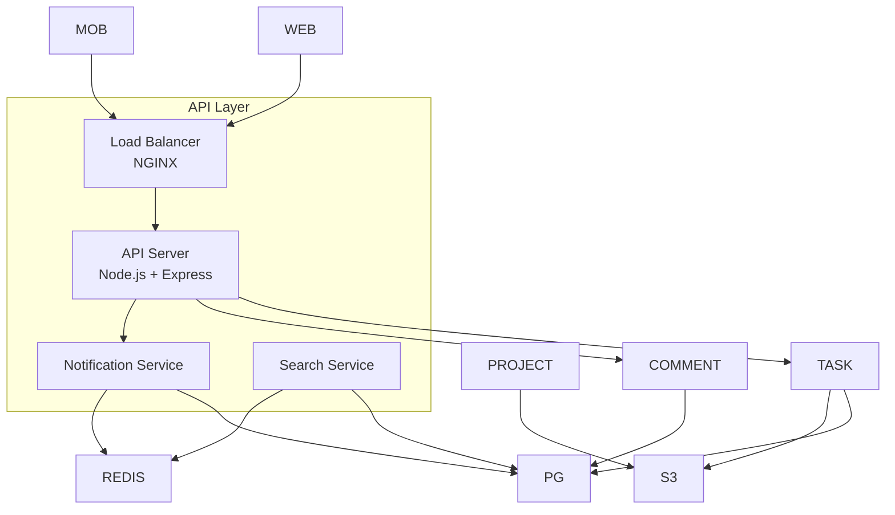
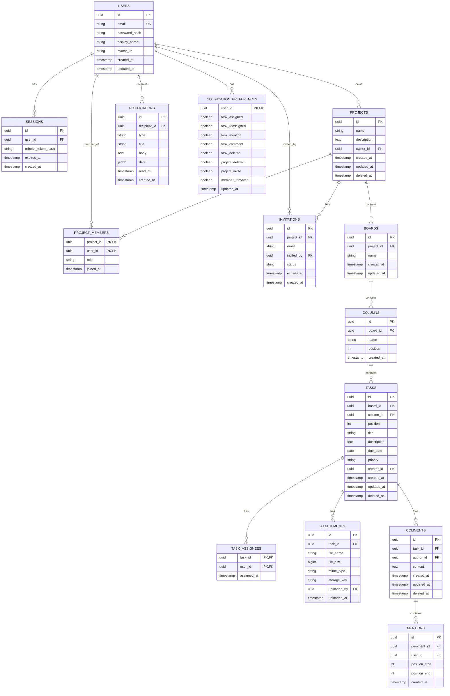

## Design Document

## Introduction

This document defines the technical design for a collaborative project management tool similar to Trello or Asana. The system enables users to create group projects, manage tasks with assignment capabilities, and facilitate team communication through task comments. This design addresses the requirements specified in the requirements document with a focus on scalability, real-time collaboration, and maintainability.

## Overview

### System Purpose

The project management tool provides a web-based platform for teams to collaborate on projects through visual task boards. Key capabilities include:

- User authentication and profile management
- Project creation with customizable boards and columns
- Task management with assignments, due dates, and priorities
- Real-time collaboration via WebSocket connections
- Comment system with @mentions support
- Notification system for relevant project activities

### Technology Stack

| Layer | Technology | Rationale |
|-------|------------|-----------|
| Frontend | React 18+ with TypeScript | Component-based architecture, strong typing, large ecosystem |
| State Management | React Query + Zustand | Server state caching + client state management |
| Backend | Node.js with Express/Fastify | JavaScript full-stack consistency, async I/O for WebSockets |
| Database | PostgreSQL | Relational data with ACID guarantees, JSON support for flexible fields |
| Cache/Pub-Sub | Redis | Session storage, WebSocket pub-sub, rate limiting |
| Real-Time | Socket.IO | WebSocket abstraction with fallbacks, room management |
| Authentication | JWT with refresh tokens | Stateless auth, secure token rotation |
| File Storage | S3-compatible storage | Scalable attachment storage |
| ORM | Prisma | Type-safe database access, migrations |
### Key Design Decisions

1. **Monolithic Backend with Modular Architecture**: Start with a modular monolith for simplicity, designed for potential future microservices extraction.

2. **WebSocket-First Real-Time Updates**: Use Socket.IO for bidirectional communication with automatic reconnection and room-based broadcasting.

---




### Request Flow

```mermaid
sequenceDiagram
    participant Client
    participant LB as Load Balancer
    participant API as API Server
    participant Service as Service Layer
    participant DB as PostgreSQL
    participant Redis as Redis Cache
    participant WS as WebSocket Server

    Client->>LB: HTTPS Request
    LB->>API: Forward Request
    API->>API: Validate JWT
        Redis-->>Service: Return Cached Data
    else Cache Miss
        Service->>DB: Query Data
    Redis->>WS: Broadcast Event
    WS->>Client: Real-time Update
    Service-->>API: Response

---

### Module Structure

```
src/
├── modules/
│   ├── auth/
│   │   ├── auth.controller.ts
│   │   ├── auth.service.ts
│   │   ├── auth.repository.ts
│   │   ├── auth.types.ts
│   │   └── auth.test.ts
│   ├── project/
│   │   ├── project.controller.ts
│   │   ├── project.service.ts
│   │   ├── project.repository.ts
│   │   ├── project.types.ts
│   │   └── project.test.ts
│   ├── board/
│   │   ├── board.controller.ts
│   │   ├── board.service.ts
│   │   ├── board.repository.ts
│   │   └── board.types.ts
│   ├── task/
│   │   ├── task.controller.ts
│   │   ├── task.service.ts
│   │   ├── task.repository.ts
│   │   └── task.types.ts
│   ├── comment/
│   │   ├── comment.controller.ts
│   │   ├── comment.service.ts
│   │   ├── comment.repository.ts
│   │   └── comment.types.ts
│   ├── notification/
│   │   ├── notification.controller.ts
│   │   ├── notification.service.ts
│   │   ├── notification.repository.ts
│   │   └── notification.types.ts
│   └── user/
│       ├── user.controller.ts
│       ├── user.service.ts
│       ├── user.repository.ts
│       └── user.types.ts
├── core/
│   ├── middleware/
│   │   ├── auth.middleware.ts
│   │   ├── error.middleware.ts
│   │   └── validation.middleware.ts
│   ├── websocket/
│   │   ├── socket.handler.ts
│   │   ├── room.manager.ts
│   │   └── event.types.ts
│   ├── events/
│   │   ├── event-bus.ts
│   │   └── event-handlers.ts
│   └── utils/
│       ├── logger.ts
│       └── validators.ts
├── config/
│   ├── database.ts
│   ├── redis.ts
│   └── socket.ts
└── app.ts
```

---

## Components and Interfaces

### Backend Components

#### Auth Module

**Responsibilities:**
- User registration and login
- Session management
- Token generation and validation
- Password hashing and verification

```typescript
interface AuthService {
  register(credentials: RegisterDTO): Promise<AuthResult>;
  login(credentials: LoginDTO): Promise<AuthResult>;
  logout(sessionId: string): Promise<void>;
  validateToken(token: string): Promise<TokenPayload>;
  refreshSession(refreshToken: string): Promise<TokenPair>;
  hashPassword(password: string): Promise<string>;
  verifyPassword(password: string, hash: string): Promise<boolean>;
}

interface RegisterDTO {
  email: string;
  password: string;
  displayName?: string;
}

interface LoginDTO {
  email: string;
  password: string;
}

interface AuthResult {
  user: UserDTO;
  accessToken: string;
  refreshToken: string;
}

interface TokenPayload {
  userId: string;
  sessionId: string;
  iat: number;
  exp: number;
}
```

#### Project Module

**Responsibilities:**
- Project CRUD operations
- Member management
- Role-based access control
- Project deletion with cascade

```typescript
interface ProjectService {
  createProject(userId: string, data: CreateProjectDTO): Promise<Project>;
  getProject(projectId: string, userId: string): Promise<Project>;
  updateProject(projectId: string, userId: string, data: UpdateProjectDTO): Promise<Project>;
  deleteProject(projectId: string, userId: string): Promise<void>;
  inviteMember(projectId: string, ownerId: string, email: string): Promise<Invitation>;
  acceptInvitation(invitationId: string, userId: string): Promise<void>;
  removeMember(projectId: string, ownerId: string, memberId: string): Promise<void>;
  updateMemberRole(projectId: string, ownerId: string, memberId: string, role: Role): Promise<void>;
}

interface CreateProjectDTO {
  name: string;
  description?: string;
}

interface Project {
  id: string;
  name: string;
  description: string | null;
  ownerId: string;
  createdAt: Date;
  updatedAt: Date;
  boards: Board[];
  members: ProjectMember[];
}

type Role = 'owner' | 'admin' | 'member';

interface ProjectMember {
  userId: string;
  projectId: string;
  role: Role;
  joinedAt: Date;
}
```

---

#### Board Module

**Responsibilities:**
- Board CRUD operations
- Column management
- Card ordering within columns

```typescript
interface BoardService {
  createBoard(projectId: string, userId: string, data: CreateBoardDTO): Promise<Board>;
  getBoard(boardId: string, userId: string): Promise<Board>;
  updateBoard(boardId: string, userId: string, data: UpdateBoardDTO): Promise<Board>;
  deleteBoard(boardId: string, userId: string): Promise<void>;
  createColumn(boardId: string, userId: string, data: CreateColumnDTO): Promise<Column>;
  updateColumn(columnId: string, userId: string, data: UpdateColumnDTO): Promise<Column>;
  deleteColumn(columnId: string, userId: string): Promise<void>;
  reorderColumns(boardId: string, userId: string, columnOrder: string[]): Promise<Board>;
}

interface Board {
  id: string;
  projectId: string;
  name: string;
  columns: Column[];
  createdAt: Date;
  updatedAt: Date;
}

interface Column {
  id: string;
  boardId: string;
  name: string;
  position: number;
  cardIds: string[];
  createdAt: Date;
}
```

#### Task Module

**Responsibilities:**
- Task CRUD operations
- Task assignment
- Status updates
- File attachments

```typescript
interface TaskService {
  createTask(boardId: string, columnId: string, userId: string, data: CreateTaskDTO): Promise<Task>;
  getTask(taskId: string, userId: string): Promise<Task>;
  updateTask(taskId: string, userId: string, data: UpdateTaskDTO): Promise<Task>;
  deleteTask(taskId: string, userId: string): Promise<void>;
  moveTask(taskId: string, userId: string, data: MoveTaskDTO): Promise<Task>;
  assignTask(taskId: string, userId: string, assigneeIds: string[]): Promise<Task>;
  unassignTask(taskId: string, userId: string, assigneeIds: string[]): Promise<Task>;
  addAttachment(taskId: string, userId: string, file: FileUpload): Promise<Attachment>;
  removeAttachment(taskId: string, userId: string, attachmentId: string): Promise<void>;
}

interface CreateTaskDTO {
  title: string;
  description?: string;
  dueDate?: Date;
  priority?: Priority;
}

interface UpdateTaskDTO {
  title?: string;
  description?: string;
  dueDate?: Date | null;
  priority?: Priority;
}

interface MoveTaskDTO {
  targetColumnId: string;
  targetPosition: number;
}

type Priority = 'low' | 'medium' | 'high' | 'urgent';

interface Task {
  id: string;
  boardId: string;
  columnId: string;
  position: number;
  title: string;
  description: string | null;
  dueDate: Date | null;
  priority: Priority;
  creatorId: string;
  assigneeIds: string[];
  attachments: Attachment[];
  comments: Comment[];
  createdAt: Date;
  updatedAt: Date;
}

interface Attachment {
  id: string;
  taskId: string;
  fileName: string;
  fileSize: number;
  mimeType: string;
  url: string;
  uploadedBy: string;
  uploadedAt: Date;
}
```

---

#### Comment Module

**Responsibilities:**
- Comment CRUD operations
- @mention parsing
- Comment formatting

```typescript
interface CommentService {
  createComment(taskId: string, userId: string, data: CreateCommentDTO): Promise<Comment>;
  updateComment(commentId: string, userId: string, data: UpdateCommentDTO): Promise<Comment>;
  deleteComment(commentId: string, userId: string): Promise<void>;
  parseMentions(content: string): Promise<MentionParseResult>;
}

interface CreateCommentDTO {
  content: string;
}

interface UpdateCommentDTO {
  content: string;
}

interface Comment {
  id: string;
  taskId: string;
  authorId: string;
  content: string;
  mentions: Mention[];
  createdAt: Date;
  updatedAt: Date | null;
}

interface Mention {
  userId: string;
  username: string;
  position: { start: number; end: number };
}

interface MentionParseResult {
  content: string;
  mentions: Mention[];
}
```

#### Notification Module

**Responsibilities:**
- Notification creation
- Delivery via WebSocket and push
- Preference management
- Read status tracking

```typescript
interface NotificationService {
  createNotification(data: CreateNotificationDTO): Promise<Notification>;
  getNotifications(userId: string, options: PaginationOptions): Promise<PaginatedResult<Notification>>;
  markAsRead(notificationId: string, userId: string): Promise<void>;
  markAllAsRead(userId: string): Promise<void>;
  updatePreferences(userId: string, preferences: NotificationPreferences): Promise<NotificationPreferences>;
  getPreferences(userId: string): Promise<NotificationPreferences>;
  deliverNotification(notification: Notification, userIds: string[]): Promise<void>;
}

interface CreateNotificationDTO {
  type: NotificationType;
  recipientIds: string[];
  title: string;
  body: string;
  data?: Record<string, unknown>;
  projectId?: string;
  taskId?: string;
}

type NotificationType = 
  | 'task_assigned'
  | 'task_reassigned'
  | 'task_mention'
  | 'task_comment'
  | 'task_deleted'
  | 'project_deleted'
  | 'project_invite'
  | 'member_removed';

interface Notification {
  id: string;
  type: NotificationType;
  recipientId: string;
  title: string;
  body: string;
  data: Record<string, unknown>;
  readAt: Date | null;
  createdAt: Date;
}

interface NotificationPreferences {
  userId: string;
  taskAssigned: boolean;
  taskReassigned: boolean;
  taskMention: boolean;
  taskComment: boolean;
  taskDeleted: boolean;
  projectDeleted: boolean;
  projectInvite: boolean;
  memberRemoved: boolean;
}
```

---

### WebSocket Components

#### Connection Handler

```typescript
interface SocketHandler {
  handleConnection(socket: Socket, next: (err?: Error) => void): void;
  handleDisconnect(socket: Socket): void;
  joinProjectRoom(socket: Socket, projectId: string): void;
  leaveProjectRoom(socket: Socket, projectId: string): void;
  broadcastToProject(projectId: string, event: string, data: unknown): void;
}

interface SocketEventMap {
  // Client -> Server
  'project:join': { projectId: string };
  'project:leave': { projectId: string };
  'task:move': { taskId: string; columnId: string; position: number };
  
  // Server -> Client
  'task:created': { task: Task };
  'task:updated': { task: Task };
  'task:moved': { taskId: string; columnId: string; position: number };
  'task:deleted': { taskId: string };
  'comment:created': { comment: Comment };
  'comment:updated': { comment: Comment };
  'comment:deleted': { commentId: string };
  'notification:new': { notification: Notification };
  'member:joined': { projectId: string; userId: string };
  'member:left': { projectId: string; userId: string };
}
```

#### Room Manager

```typescript
interface RoomManager {
  joinRoom(socketId: string, room: string): void;
  leaveRoom(socketId: string, room: string): void;
  leaveAllRooms(socketId: string): void;
  getRoomMembers(room: string): string[];
  getUserRooms(socketId: string): string[];
  broadcast(room: string, event: string, data: unknown): void;
}
```

### Frontend Components

#### Component Hierarchy

```
App
├── AuthProvider
│   ├── LoginPage
│   ├── RegisterPage
│   └── PasswordResetPage
├── Layout
│   ├── Header
│   │   ├── UserMenu
│   │   └── NotificationBell
│   ├── Sidebar
│   │   └── ProjectList
│   └── MainContent
│       ├── DashboardPage
│       ├── ProjectPage
│       │   ├── BoardList
│       │   └── BoardView
│       │       ├── Column
│       │       │   └── Card
│       │       └── TaskDetail
│       │           ├── TaskInfo
│       │           ├── CommentList
│       │           └── AttachmentList
│       ├── ProfilePage
│       └── SettingsPage
│           └── NotificationPreferences
└── ToastProvider
```

---

#### Key Frontend Interfaces

```typescript
// State Management
interface AppState {
  auth: AuthState;
  projects: ProjectsState;
  boards: BoardsState;
  tasks: TasksState;
  notifications: NotificationsState;
  ui: UIState;
}

interface AuthState {
  user: User | null;
  isAuthenticated: boolean;
  isLoading: boolean;
}

interface ProjectsState {
  items: Project[];
  activeProjectId: string | null;
  isLoading: boolean;
}

interface UIState {
  sidebarCollapsed: boolean;
  theme: 'light' | 'dark';
  modals: ModalState;
}

// React Query Keys
const queryKeys = {
  projects: ['projects'] as const,
  project: (id: string) => ['projects', id] as const,
  board: (id: string) => ['boards', id] as const,
  task: (id: string) => ['tasks', id] as const,
  notifications: ['notifications'] as const,
} as const;
```

---

## Data Models

### Entity Relationship Diagram



---

### Database Schema (PostgreSQL)

```sql
-- Enable UUID extension
CREATE EXTENSION IF NOT EXISTS "uuid-ossp";

-- Users table
CREATE TABLE users (
    id UUID PRIMARY KEY DEFAULT uuid_generate_v4(),
    email VARCHAR(255) NOT NULL UNIQUE,
    password_hash VARCHAR(255) NOT NULL,
    display_name VARCHAR(100),
    avatar_url TEXT,
    created_at TIMESTAMP WITH TIME ZONE NOT NULL DEFAULT NOW(),
    updated_at TIMESTAMP WITH TIME ZONE NOT NULL DEFAULT NOW()
);

CREATE INDEX idx_users_email ON users(email);

-- Sessions table
CREATE TABLE sessions (
    id UUID PRIMARY KEY DEFAULT uuid_generate_v4(),
    user_id UUID NOT NULL REFERENCES users(id) ON DELETE CASCADE,
    refresh_token_hash VARCHAR(255) NOT NULL,
    expires_at TIMESTAMP WITH TIME ZONE NOT NULL,
    created_at TIMESTAMP WITH TIME ZONE NOT NULL DEFAULT NOW()
);

CREATE INDEX idx_sessions_user_id ON sessions(user_id);
CREATE INDEX idx_sessions_expires_at ON sessions(expires_at);

-- Projects table
CREATE TABLE projects (
    id UUID PRIMARY KEY DEFAULT uuid_generate_v4(),
    name VARCHAR(255) NOT NULL,
    description TEXT,
    owner_id UUID NOT NULL REFERENCES users(id) ON DELETE CASCADE,
    created_at TIMESTAMP WITH TIME ZONE NOT NULL DEFAULT NOW(),
    updated_at TIMESTAMP WITH TIME ZONE NOT NULL DEFAULT NOW(),
    deleted_at TIMESTAMP WITH TIME ZONE
);

CREATE INDEX idx_projects_owner_id ON projects(owner_id);
CREATE INDEX idx_projects_deleted_at ON projects(deleted_at);

-- Project members table
CREATE TABLE project_members (
    project_id UUID NOT NULL REFERENCES projects(id) ON DELETE CASCADE,
    user_id UUID NOT NULL REFERENCES users(id) ON DELETE CASCADE,
    role VARCHAR(20) NOT NULL DEFAULT 'member' CHECK (role IN ('owner', 'admin', 'member')),
    joined_at TIMESTAMP WITH TIME ZONE NOT NULL DEFAULT NOW(),
    PRIMARY KEY (project_id, user_id)
);

CREATE INDEX idx_project_members_user_id ON project_members(user_id);
```

---
